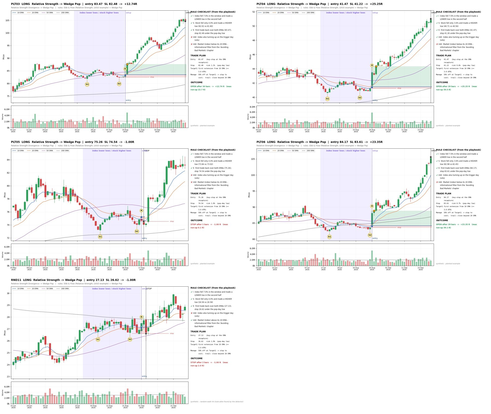

# Synthetic Pattern Recognition System for Swing Setups based on Oliver Kell's public materials 
### by CODE__PEARL

## What This Is

This repository contains a synthetic pattern recognition system I structured
during my research into swing trading setups that were used by *Oliver Kell the 2020 U.S. Investing Champion* . The system is built from
interview material, trading education content, and my own synthesis of the
concepts into a formalized recognition framework.

The goal is not to replicate any single source, but to encode the underlying
logic of swing setup identification into something testable and repeatable.

## Attribution

This project is a **derivative research effort** built on top of publicly
available educational content. I did not invent the underlying trading
principles — I structured, formalized, and implemented them.

Portions of the conceptual framework were informed by the following YouTube
videos and channels. All credit for the original ideas belongs to their
respective creators:

| Source | Link |
|---|---|
| Oliver Kell — The 10 Principles of Trading (TraderLion) | https://www.youtube.com/watch?v=ElocJ-b_NTs |
| Video 2 | https://www.youtube.com/watch?v=m8F3KkBDtC0 |
| Video 3 (Playlist: PLF-oajkv9d9d3f9NxAzKIZfLO53tgolFl, Index 18) | https://www.youtube.com/watch?v=8gu1MycjaFU |
| Video 4 | https://www.youtube.com/watch?v=eME0S4lwEz0 |
| Video 5 | https://www.youtube.com/watch?v=4HA2hBrpMRU |
| Video 6 | https://www.youtube.com/watch?v=ltXlF8Z0WFg |

> **Note:** I am not affiliated with, endorsed by, or sponsored by any of the
> creators or channels above. Their content is referenced here for
> transparency about where the foundational ideas came from.

## Methodology

1. **Extraction** — Pulled the core setup criteria from interview and
   educational content.
2. **Formalization** — Converted discretionary descriptions into measurable
   conditions (price structure, volume behavior, trend context, etc.).
3. **Synthetic Generation** — Created synthetic pattern data to test the
   recognition logic against controlled examples.
4. **Validation** — Compared detected patterns against known swing setup
   archetypes.

 ## Structure
.
├── _overview.jpg # System overview diagram
├── src/ # Recognition logic
├── data/ # Synthetic pattern datasets
└── README.md
'

## Status

Research in progress. This is a personal research project, not production
trading software. Nothing here constitutes financial advice.

## Disclaimer

- This is an educational and research project only.
- No guarantee of accuracy or profitability.
- All referenced external content remains the property of its original
  creators.
